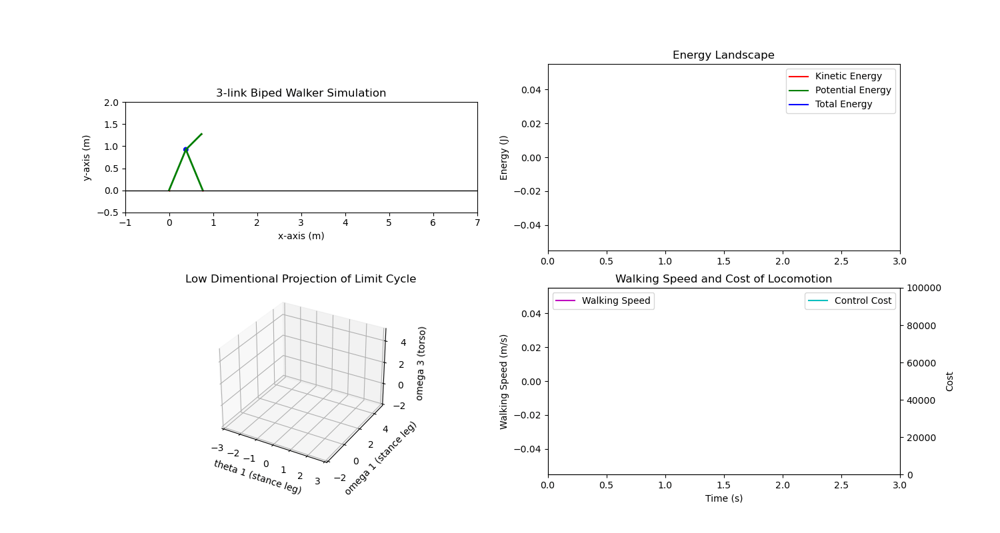

# Planar-Bipedal-Walker
## Implementation of planar bipedal walkers using Hybrid Zero Dynamics in Python.  
Working at progress. Currently get a workable and correct hybrid dynamics and control for 3-link walkers
and finish a rough animation for visualization purpose, shown in gif file below. More to come.  
## Future Plan:  
1. 5-link walker  
2. Trajectory Optimization using pydrake  (currently get the coefficients directly from literature)  
3. Hybrid Zero Dynamics Implementation. More theory behind the model  
4. Other control (trajectory-following) method including PID and MPC control  
5. More graceful simulation using pydrake or other tools.  

Note: Developing part-time. It takes time.  

## Visualization

